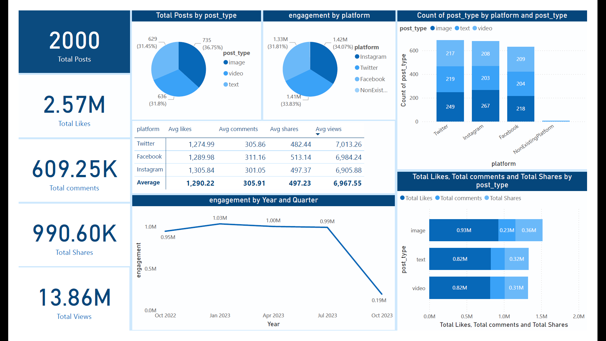

# Social Media Analysis

## Overview

This repository contains a comprehensive analysis of social media data, focusing on various engagement metrics. The objective of this analysis is to understand user engagement across different social media platforms by examining the performance of various post types. By analyzing the data, we aim to identify trends, optimize content strategies, and enhance user interaction.

## Dataset Overview

The dataset includes information on posts from platforms such as Twitter, Instagram, and Facebook, capturing key metrics like likes, shares, comments, and views. It includes columns like platform, post type, views, comments, and more.

## Exploratory Data Analysis (EDA)

Exploratory Data Analysis was performed using Python and Pandas to uncover insights and trends within the dataset. The following visualizations were created to illustrate key findings:

- Distribution of post types across different platforms.
- Engagement metrics (likes, shares, comments) over time.
- Comparison of average likes, comments, shares, and views by platform.

## Dashboard

A Power BI dashboard was created to provide an interactive visualization of the analysis results. The dashboard allows users to explore the data dynamically, focusing on key metrics and trends.

## Tools

- **Python** for EDA and data visualization
- **Power BI** for dashboard creation
